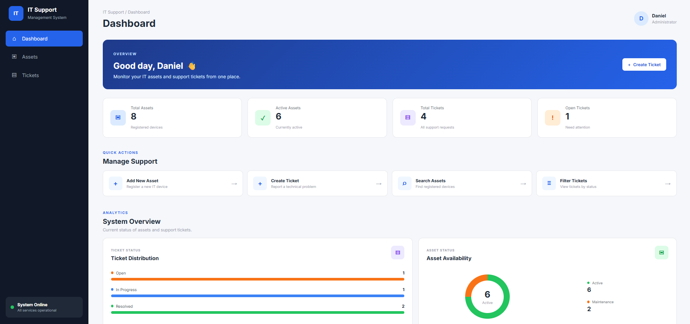
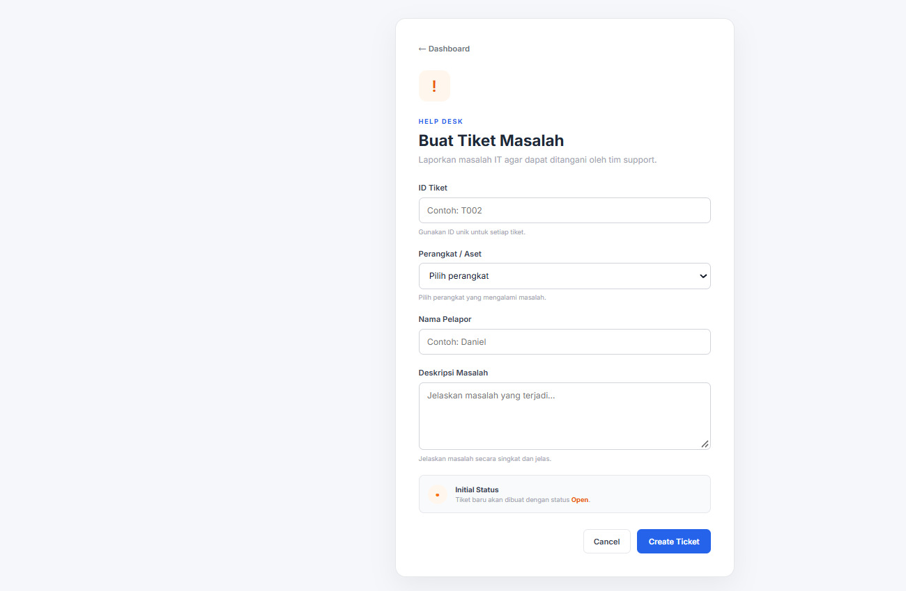
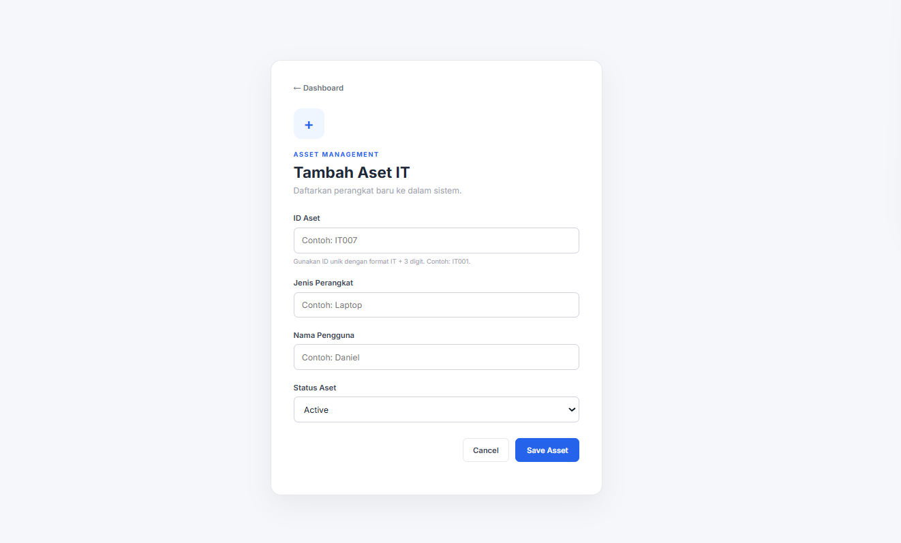

# IT Support Management System

A web-based IT Support Management System built with **Python, Flask, and SQLite** to manage IT assets and support tickets.

This project was developed as a portfolio project to demonstrate basic **IT Support, Software Engineering, database management, CRUD operations, validation, and web application development**.

## Features

### IT Asset Management

* Add new IT assets
* View registered IT assets
* Update asset status
* Delete assets
* Search assets by:

  * Asset ID
  * Device type
  * User
  * Status

### IT Ticket Management

* Create support tickets
* View support tickets
* Update ticket status
* Delete tickets
* Search tickets by Ticket ID
* Filter tickets by status:

  * Open
  * In Progress
  * Resolved

### Dashboard & Analytics

* Total assets
* Active assets
* Total tickets
* Open tickets
* Asset status percentage
* Recent support tickets
* Asset and ticket overview

### Validation

The application includes input validation for:

* Asset ID format
* Ticket ID format
* Required fields
* Asset status
* Ticket status
* Duplicate Asset ID
* Duplicate Ticket ID
* Asset existence when creating a ticket

## Screenshots

### Dashboard

Dashboard memberikan gambaran umum mengenai aset IT, tiket support, distribusi status tiket, dan ketersediaan aset.



### Create Ticket

Halaman pembuatan tiket digunakan untuk membuat tiket support dengan memilih aset, memasukkan nama pelapor, dan menjelaskan masalah yang dilaporkan.



### Add Asset

Halaman penambahan aset digunakan untuk mendaftarkan aset IT baru beserta informasi perangkat, pengguna, dan status aset.



## Tech Stack

* **Python**
* **Flask**
* **SQLite**
* **HTML**
* **CSS**
* **Jinja2**
* **Git & GitHub**

## Project Structure

```text
IT-Support-System/
│
├── app.py
├── database.py
├── main.py
├── assets.db
├── .gitignore
├── README.md
│
├── static/
│   └── style.css
│
└── templates/
    ├── index.html
    ├── add_asset.html
    ├── add_ticket.html
    ├── search_asset.html
    ├── search_ticket.html
    └── filter_ticket.html
```

## Database

The application uses **SQLite** as its database.

The database contains two main tables:

### Assets

Stores IT asset information such as:

* Asset ID
* Device type
* User
* Asset status

### Tickets

Stores support ticket information such as:

* Ticket ID
* Asset ID
* Reporter
* Problem description
* Ticket status
* Created date and time

The application also uses a relationship between assets and tickets to connect support tickets with the corresponding IT asset.

## Ticket Status

Tickets can have one of the following statuses:

```text
Open
In Progress
Resolved
```

## Asset Status

Assets can have one of the following statuses:

```text
Active
Maintenance
```

## Validation Example

Asset IDs use the following format:

```text
IT001
IT002
IT003
```

Ticket IDs use the following format:

```text
T001
T002
T003
```

The application validates these formats before storing data in the database.

## How to Run

### 1. Clone the repository

```bash
git clone https://github.com/ambaritadaniel1004-a11y/IT-Support-System.git
```

### 2. Open the project directory

```bash
cd IT-Support-System
```

### 3. Install Flask

```bash
pip install flask
```

### 4. Run the application

```bash
python app.py
```

### 5. Open the application

Open your browser and go to:

```text
http://127.0.0.1:5000
```

## Example Workflow

A typical support workflow in the application:

```text
Create IT Asset
      ↓
Create Support Ticket
      ↓
Ticket Status: Open
      ↓
Ticket Status: In Progress
      ↓
Ticket Status: Resolved
```

## Skills Demonstrated

This project demonstrates practical experience with:

* Python programming
* Flask web development
* SQLite database
* SQL queries
* CRUD operations
* Database relationships
* Input validation
* Error handling
* HTML & CSS
* Jinja2 templates
* Dashboard development
* Git
* GitHub

## Future Improvements

Potential improvements for future versions include:

* User authentication and authorization
* Role-based access control
* Ticket priority
* Ticket categories
* Attachment support
* User management
* Advanced reporting
* REST API
* Deployment to a cloud platform

## Author

**Daniel Ambarita**

Electrical Engineering — Telecommunications / Multimedia

GitHub:
https://github.com/ambaritadaniel1004-a11y
